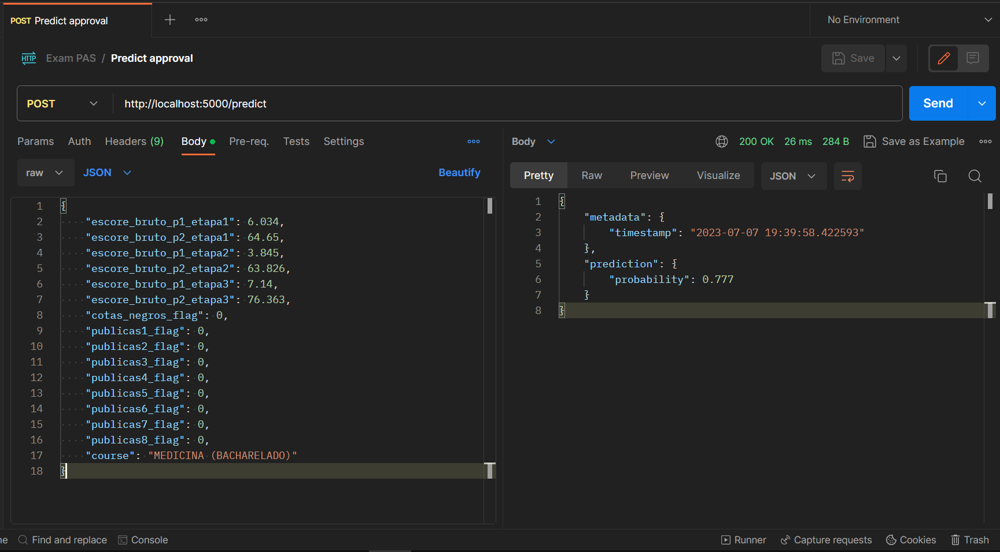

# exam-pas


Este é o repositório do projeto **PAS Vision**. É uma ferramenta - destinada aos estudantes que irão prestar esse exame ou já iniciaram alguma das etapas - capaz de fornecer uma probabilidade de aprovação dado o curso desejado, se é cotista e preferencialmente notas das duas primeiras etapas.

Os dados estão originalmente presentes em *https://www.cebraspe.org.br/pas/subprogramas*, todos em formato .pdf e foram tratados por expressões regulares. Pelo site citado, é possível obter os resultados em cada etapa por meio dos documentos com o título **"Resultado final nos itens do tipo D, o resultado final na prova de redação em Língua Portuguesa e o resultado final dos candidatos não eliminados na terceira etapa"**. Em relação os dados dos aprovados, o documento que faz mais sentido utilizar é o identificado por **"Convocação, em primeira chamada, para o registro acadêmico on-line dos candidatos selecionados dentro do quantitativo de vagas para o primeiro (ou segundo) semestre"**, pois possui a lista de aprovados logo após a apuração dos resultados. Então, aprovados que eventualmente desistiram de ingressar por qualquer motivo, e.g., passaram em outra universidade, são considerados.

As *features* que alimentam o modelo se dividem em dois tipos:
1. *features* de escores em cada etapa do exame, flags que indicam se o candidato se enquadra em um algum sistema de cota, curso desejado que são informações diretamente entregues pelo Cebraspe

2. *features* derivadas após *feature engineering*: 
    * **Pseudo Argumento Final (PAF)**: essa medida consiste em uma média ponderada dos escores das principais partes do exame;
    * **Mínimo Flag**: medida que indica se o candidato obteve um PAF maior que o mínimo dos PAF's do subprograma anterior no curso desejado;
    * **Mediana Flag**: medida que indica se o candidato obteve um PAF maior que a mediana dos PAF's do subprograma anterior no curso desejado;

Após a construção das *features*, um modelo *Extreme Gradient Boosting (XGBoost)* é ajustado. Os dados dos subprogramas 2019-2021 e 2020-2022 foram utilizados do seguinte modo: para treinamento, dados de ambos os subprogramas são considerados, mas o conjunto de dados de teste só apresenta observações de 2020-2022.

No final, o modelo treinado é salvo como .pickle e fica disponível para o script que monta a API por Flask. Por meio dessa API, é possível fazer uma requisição POST com o input dos valores das suas features para obter a predição de probabilidade.

O formato do input das features que cabem unicamente usuário fornecer segue a seguinte estrutura:

```
{
    "escore_bruto_p1_etapa1": 6.034,
    "escore_bruto_p2_etapa1": 64.65,
    "escore_bruto_p1_etapa2": 3.845,
    "escore_bruto_p2_etapa2": 63.826,
    "escore_bruto_p1_etapa3": 7.14,
    "escore_bruto_p2_etapa3": 76.636,
    "cotas_negros_flag": 0,
    "publicas1_flag": 0,
    "publicas2_flag": 0,
    "publicas3_flag": 0,
    "publicas4_flag": 0,
    "publicas5_flag": 0,
    "publicas6_flag": 0,
    "publicas7_flag": 0,
    "publicas8_flag": 0,
    "course": "MEDICINA (BACHARELADO)"
}
```

Em que:
* **escore_bruto_p1_etapa1**: escore bruto da parte 1 na primeira etapa;
* **escore_bruto_p2_etapa1**: escore bruto da parte 2 na primeira etapa;
* **escore_bruto_p1_etapa2**: escore bruto da parte 1 na segunda etapa;
* **escore_bruto_p2_etapa2**: escore bruto da parte 2 na segunda etapa;
* **escore_bruto_p1_etapa3**: escore bruto da parte 1 na terceira etapa;
* **escore_bruto_p1_etapa3**: escore bruto da parte 2 na terceira etapa;
* **cotas_negros_flag**: indica se faz parte de Sistema de Cotas para Negros;
* **publicas1_flag**: indica se faz parte de Sistema de Cotas para Escolas Públicas, com renda familiar bruta igual ou inferior a 1,5 salário mínimo per capita que se autodeclararam pretos, pardos ou indígenas;
* **publicas2_flag**: indica se faz parte de Sistema de Cotas para Escolas Públicas, com renda familiar bruta igual ou inferior a 1,5 salário mínimo per capita que se autodeclararam pretos, pardos ou indígenas e que concorrem como pessoas com deficiência;
* **publicas3_flag**: indica se faz parte de Sistema de Cotas para Escolas Públicas, com renda familiar bruta igual ou inferior a 1,5 salário mínimo per capita que não se autodeclararam pretos, pardos ou indígenas;
* **publicas4_flag**: indica se faz parte de Sistema de Cotas para Escolas Públicas, com renda familiar bruta igual ou inferior a 1,5 salário mínimo per capita que não se autodeclararam pretos, pardos ou indígenas e que concorrem como pessoas com deficiência;
* **publicas5_flag**: indica se faz parte de Sistema de Cotas para Escolas Públicas, com renda familiar bruta superior a 1,5 salário mínimo per capita que se autodeclararam pretos, pardos ou indígenas;
* **publicas6_flag**: indica se faz parte de Sistema de Cotas para Escolas Públicas, com renda familiar bruta superior a 1,5 salário mínimo per capita que se autodeclararam pretos, pardos ou indígenas e que concorrem como pessoas com deficiência;
* **publicas7_flag**: indica se faz parte de Sistema de Cotas para Escolas Públicas, com renda familiar bruta superior a 1,5 salário mínimo per capita que não se autodeclararam pretos, pardos ou indígenas;
* **publicas8_flag**: indica se faz parte de Sistema de Cotas para Escolas Públicas, com renda familiar bruta superior a 1,5 salário mínimo per capita que não se autodeclararam pretos, pardos ou indígenas e que concorrem como pessoas com deficiência.

